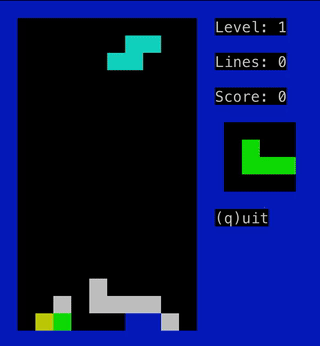

# Zigtris

A minimal terminal Tetris written in Zig. Tested with Zig 0.15.2

`zig build run`

Cursor keys to move, space to drop, `q` to quit.

# Run as a service via ssh

    ./run-as-service.sh

    ssh zigtris@localhost -p 2022

# Notes

Some notes for anyone looking at the code:

 - `Display` is a thin wrapper on top of the `mibu` terminal library, it provides a double buffered one pixel per character interface where it only redraws changed pixels on the buffer flip
 - `Stage` is the game stage and provides a square pixel interface on top of `Display` (by printing two chars for each pixel)
 - `Player` holds the `Tetronimo` shapes and movement logic
 - `Debris` holds the list of fallen blocks for hitchecking and completed line detection

# License

MIT

